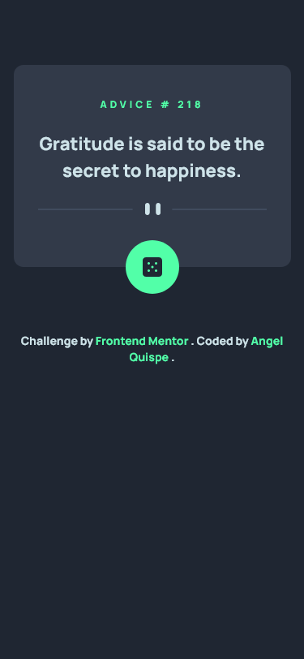
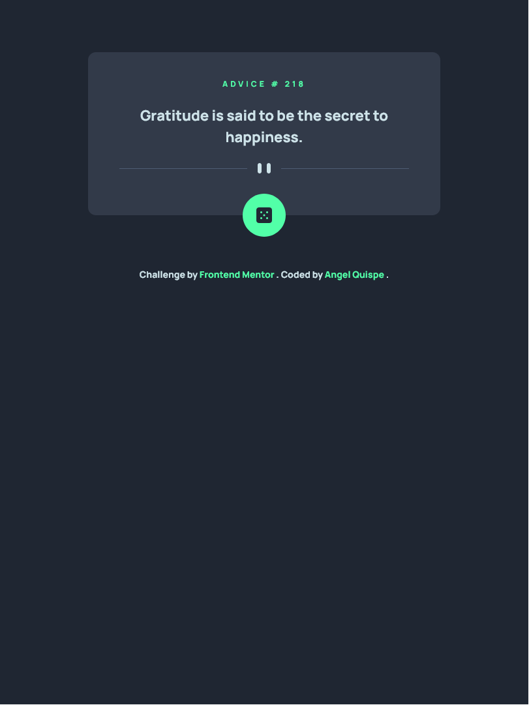
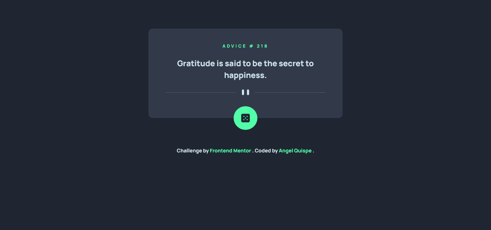

# Frontend Mentor - Advice generator app solution

Esta es uan solución para [Advice generator app challenge on Frontend Mentor](https://www.frontendmentor.io/challenges/advice-generator-app-QdUG-13db).

## Tabla de contenido

- [Descripción general](#descripción-general)
  - [El reto](#el-reto)
  - [Screenshot](#screenshot)
  - [Links](#links)
- [Mi proceso](#mi-proceso)
  - [Construido con](#construido-con)
  - [Aprendizaje](#aprendizaje)
  - [Desarrollo continuo](#desarrollo-continuo)
- [Autor](#autor)
- [Agradecimiento](#agradecimiento)


## Descripción general

### El reto

Los usuarios deben ser capaces de:

- Ver el diseño óptimo para la aplicación según el tamaño de pantalla de su dispositivo
- Ver estados de desplazamiento para todos los elementos interactivos en la página
- Genere un nuevo consejo haciendo clic en el icono de dado

### Screenshot

**Vista desde un celular**


**Vista desde una tablet**


**Vista desde una laptop**



### Links

- Solution URL: [Github](https://github.com/AngelQP/AngelQP.github.io-Reto-Frontend-2)
- Live Site URL: [Render](https://advice-generator-uk88.onrender.com/)

## Mi proceso

### Construido con

- Semantic HTML5 markup
- CSS custom properties
- Tailwind
- JS Vanilla
- Vite
- Mobile-first workflow

### Aprendizaje

En esta ruta de aprendizaje al usar Tailwind me encontre como hacer un uso efectivo del calc y asi evitar conflictos cuando se quiere hacer responsive la pagina

Dentro va un dado, el tema es calcular para que esta se centre sin importar el tamaño de la pantalla:

```html
<div id="diceBtn" class="bg-NeonGreen w-[66px] h-[66px] rounded-full grid place-content-center absolute left-[calc(50%-33px)] bottom-[-33px] cursor-pointer hover:drop-shadow-[0_0_16px_hsl(150,100%,66%)]">
  
</div>
```

### Desarrollo continuo

Deseo seguir enfocandome en el consumo de API para realizarlo de una manera mas efectiva, con codigo funcional que permita ser reusado y de facil escalabilidad.

## Autor

- Website - [Angel Quispe](https://angel-qp-github-io.vercel.app/)
- Frontend Mentor - [@angelQuispe](https://www.frontendmentor.io/profile/AngelQP)
- Github - [@AngelQP](https://github.com/AngelQP)

## Agradecimiento

"El éxito se encuentra en lograr cada día un pequeño objetivo"

